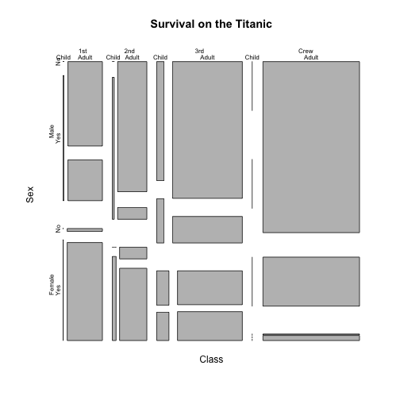
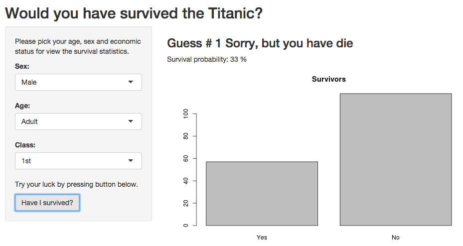

Titanic survival statistics
========================================================
author: Evgeny Ivanov
date: Sat Jun 20 11:07:53 2015

About Titanic
========================================================

The sinking of the Titanic is a famous event, and new books are still being published about it. Many well-known facts—from the proportions of first-class passengers to the ‘women and children first’ policy, and the fact that that policy was not entirely successful in saving the women and children in the third class—are reflected in the survival rates for various classes of passenger.

These data were originally collected by the British Board of Trade in their investigation of the sinking. Note that there is not complete agreement among primary sources as to the exact numbers on board, rescued, or lost.

Data preview
========================================================

 

App Interface
========================================================



Reactive calculation of survival stats
========================================================


```r
getSurvived <- function (class, age, sex) {
  stats <- subset(data, Class == class & Sex == sex & Age == age)
  survived <- list(
    "Yes" = subset(stats, Survived == "Yes")[, "Freq"],
    "No"  = subset(stats, Survived == "No")[, "Freq"]
  )

  survived["Total"] <- survived$Yes + survived$No
  if (survived$Total != 0) {
    survived["Percent"] <- round(100 * survived$Yes / survived$Total)
  } else {
    survived["Percent"] <- 0
  }

  return(survived)
}
```

Test it now!
========================================================

The program can be found here: "https://tyz910.shinyapps.io/titanic"
